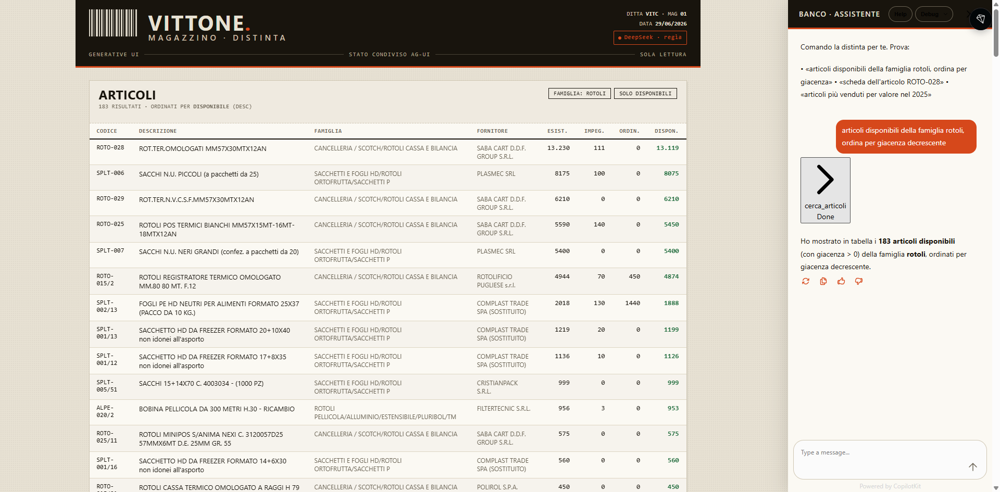
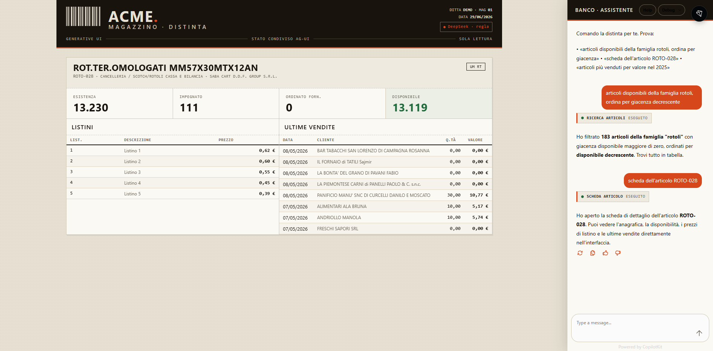
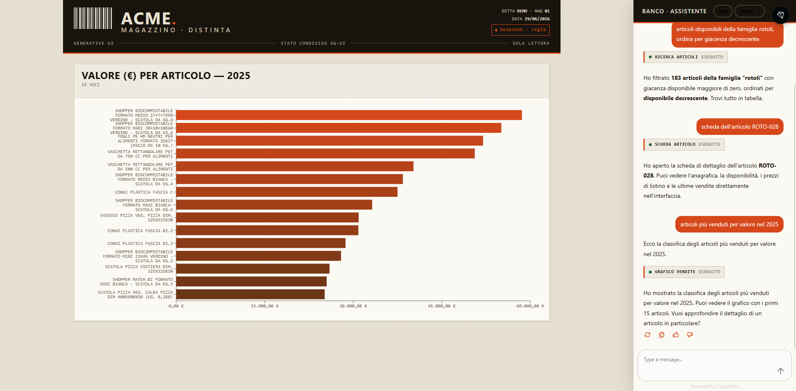

<div align="center">

# ERP Generative UI

**Una chat che pilota un'interfaccia gestionale deterministica — su dati reali.**

Generative UI a *stato condiviso*: l'LLM non disegna la UI, ne **orchestra** i componenti.
Tabella, scheda articolo e grafici tradizionali, guidati dal linguaggio naturale.




</div>

---

## Cos'è

Esperimento di **Generative UI** sul pattern più solido: lo **stato condiviso** (AG-UI).
A differenza del "tutto dentro la chat", qui l'interfaccia resta quella classica e ottimizzata
per i dati — molte righe, ordinamenti, grafici — mentre l'AI fa da **regista**: capisce la
richiesta e decide *quale* componente mostrare e con *quali filtri/dati*.

L'LLM non genera HTML/React arbitrario: compone componenti registrati e deterministici.
Coerenza, design system e controllo restano dalla parte dell'applicazione.

> Ispirato al filone "Generative UI" (AI SDK / CopilotKit / AG-UI / MCP), ma con backend
> **Python/Agno** invece che TypeScript: il contratto AG-UI è identico, il linguaggio no.

## ⭐ Caratteristiche

- 💬 **Chat → UI**: "mostra i rotoli disponibili, ordina per giacenza" filtra e ordina una tabella reale.
- 🔄 **Stato condiviso bidirezionale** via protocollo AG-UI (snapshot + delta, SSE).
- 🧩 **Componenti deterministici**: tabella, scheda articolo, grafico vendite.
- 🔒 **Privacy STRICT**: i dati non vengono mai inviati all'LLM (vedi sotto).
- 📊 **Dati veri**: query parametriche read-only su viste SQL Server (anagrafica, giacenze, vendite, listini).

## 🔒 Privacy — l'LLM fa solo da regista

Il punto chiave. In un flusso agente classico l'LLM vede i risultati dei tool → i dati
finirebbero sul cloud del modello. Qui no:

```
Utente: "rotoli disponibili, ordina per giacenza"
   │
   ▼
DeepSeek vede SOLO: messaggio utente + parametri tool      ← nessun dato sensibile
   │  tool: cerca_articoli(famiglia="rotoli", solo_disp=true, sort="esistenza")
   ▼
Backend: esegue la SELECT
   ├──► dati nello stato condiviso ──► STATE_SNAPSHOT ──► Frontend (render)   [dati qui]
   └──► all'LLM torna SOLO: "Mostrati 183 articoli"        ← nessuna riga
```

L'agente gira con `add_session_state_to_context=False`: il contenuto dello stato (righe,
nomi clienti, vendite) **non entra mai** nel prompt. Verificato sullo stream `/agui`.

**STRICT-selettivo.** Non tutti i dati sono uguali: i **fatti di prodotto**
(descrizione, prezzo di listino, giacenza) NON sono dati personali, quindi il tool
`trova_prezzo` può restituirli all'LLM perché li riferisca a voce — utile al banco
("la pellicola H30 costa 0,77 €, ne hai 953"). I **dati personali/commerciali**
(clienti, vendite nominative, agenti) restano solo a schermo, mai nel prompt.

## 🏗️ Architettura

```
┌──────────────────────────────┐      AG-UI / SSE       ┌──────────────────────────────┐
│  Next.js + CopilotKit         │  ◄── stato condiviso ─►│  Agno Agent (FastAPI /agui)    │
│  useCoAgent("my_agent")       │   {view, filtri, sort, │  LLM: DeepSeek (regìa)         │
│  render su state.view:        │    rows, articolo,     │  tools read-only               │
│   table · detail · chart      │    chart…}             │     │                          │
└──────────────────────────────┘                        │     ▼  pyodbc (SELECT)         │
                                                         │  viste AI del gestionale       │
                                                         └──────────────────────────────┘
```

| Livello   | Tecnologia |
|-----------|------------|
| Frontend  | Next.js 14 · CopilotKit 1.61 · `@ag-ui/agno` · Recharts |
| Protocollo| AG-UI (SSE, snapshot + state delta) |
| Backend   | Python · Agno (interfaccia `AGUI` su FastAPI) |
| LLM       | DeepSeek (`deepseek-chat`) — orchestrazione, mai i dati |
| Dati      | SQL Server (pyodbc), viste AI in sola lettura |

## 🧰 Cosa sa fare l'agente

| Tool | Esempio in chat | Componente |
|------|-----------------|------------|
| `cerca_articoli` | *"articoli disponibili della famiglia rotoli, ordina per giacenza"* | Tabella filtrata/ordinata |
| `trova_prezzo` | *"avete pellicola da 30? quanto costa?"* | Tabella + prezzo/giacenza riferiti a voce |
| `dettaglio_articolo` | *"scheda dell'articolo ROTO-028"* | Scheda: giacenze + listini + ultime vendite |
| `grafico_vendite` | *"articoli più venduti per valore nel 2025"* | Grafico a barre aggregato |

I filtri di `cerca_articoli` sono **sticky**: nei follow-up ("ordina per esistenza",
"solo disponibili") basta dire ciò che cambia, gli altri filtri restano. La ricerca testo
è tokenizzata e cerca anche per famiglia ("rotoli cassa" → famiglia "Rotoli cassa e bilancia").

## 🖼️ Schermate

| Scheda articolo | Grafico vendite |
|---|---|
|  |  |

## 🚀 Avvio

Prerequisiti: **Node 18+**, **Python 3.13** + [uv](https://docs.astral.sh/uv/),
**ODBC Driver 17 for SQL Server**, una chiave **DeepSeek**.

### 1. Backend (porta 8000)
```bash
cd backend
cp .env.example .env      # compila DB_CONN e DEEPSEEK_API_KEY
uv run uvicorn agent:app --host 127.0.0.1 --port 8000
```

### 2. Frontend (porta 3000)
```bash
cd frontend
npm install
npm run dev
```

Apri **http://localhost:3000** e scrivi nella chat a destra.

## 🎤 Voce (caso d'uso banco)

Nel masthead c'è il pulsante **🎤 Voce**: detti la domanda invece di scriverla
(es. *"avete pellicola da 30? quanto costa?"*) e parte la stessa pipeline.
Usa la **Web Speech API** del browser (Chrome/Edge) — zero dipendenze.

> ⚠️ La Web Speech API può inviare l'audio ai server del browser. Per un kiosk
> GDPR-clean, sostituire lo STT con **Whisper locale** (whisper.cpp / faster-whisper)
> che alimenta la stessa `appendMessage`: così né audio né dati lasciano l'azienda.

C'è anche **↺ Nuova** per azzerare chat e schermata.

## 📁 Struttura

```
backend/
  db.py        # pyodbc + query parametriche sulle viste AI
  tools.py     # tool Agno (STRICT): dati → stato, conteggi → LLM
  agent.py     # Agent DeepSeek + interfaccia AGUI su FastAPI
  .env.example # variabili d'ambiente (DB_CONN, DEEPSEEK_API_KEY)
frontend/
  app/api/copilotkit/route.ts  # runtime CopilotKit → AgnoAgent(/agui)
  app/page.tsx                 # provider + masthead + CopilotSidebar
  components/                  # Canvas, TabellaArticoli, SchedaArticolo, GraficoVendite
  lib/state.ts                 # tipi dello stato condiviso
```

## 🎨 Design

Identità "**distinta di magazzino**": tipografia condensata da segnaletica
(Saira Condensed) + UI/dati IBM Plex (Sans + Mono, cifre tabellari), palette kraft +
inchiostro + arancio segnale. Le tabelle ricalcano una lista di picking stampata.

## ⚠️ Note

- Demo **read-only**: nessuna scrittura sul gestionale.
- Il nome agente (`my_agent`) deve combaciare tra `route.ts`, il provider e `useCoAgent`.
- `.env` non è versionato: contiene credenziali. Usa `.env.example` come modello.

---

<div align="center">
<sub>Demo didattica · Generative UI a stato condiviso · Agno + DeepSeek + CopilotKit</sub>
</div>
