# Presentazione — ERP Generative UI

Set di schermate per la demo, raggruppate per area. Marchio demo generico **ACME**.
Tutto su dati reali; l'LLM (DeepSeek) fa da regista, i dati restano a schermo (privacy STRICT).

## Flusso suggerito

### 0 · Intro
| | |
|---|---|
| 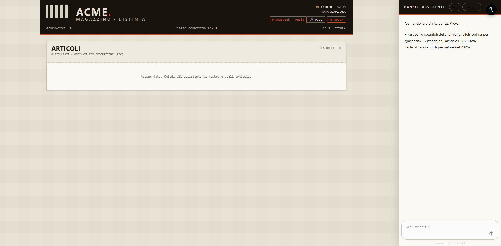 | **Home** — masthead "distinta di magazzino", chat a destra. L'LLM instrada, la UI è deterministica. |

### 1 · Articoli
| Schermata | Cosa mostra |
|---|---|
| 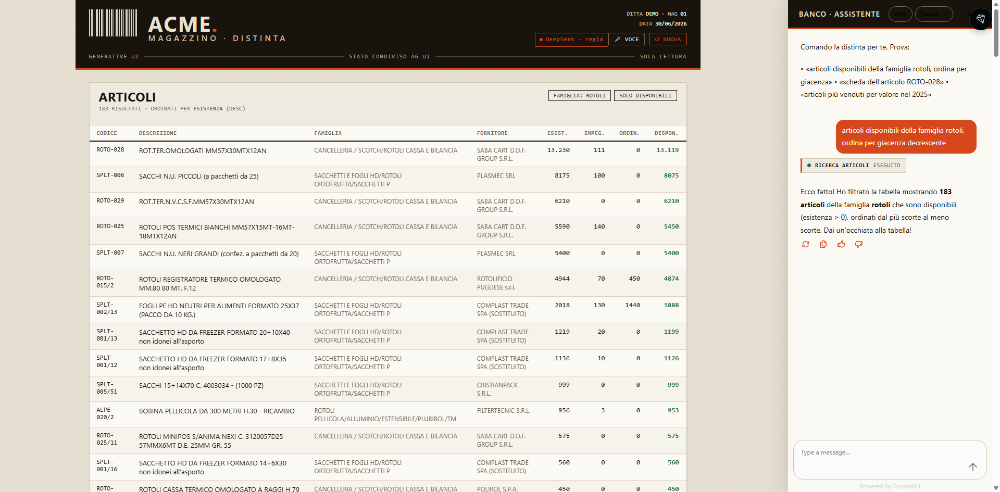 | «articoli disponibili della famiglia rotoli, ordina per giacenza» → tabella filtrata/ordinata |
| 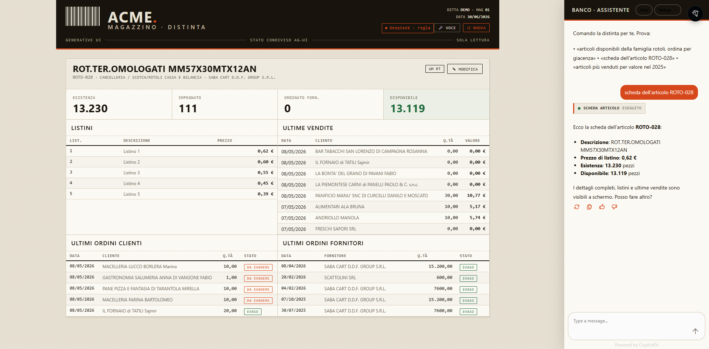 | «scheda dell'articolo ROTO-028» → giacenze, listini, ultime vendite, ultimi ordini cli/forn |
| 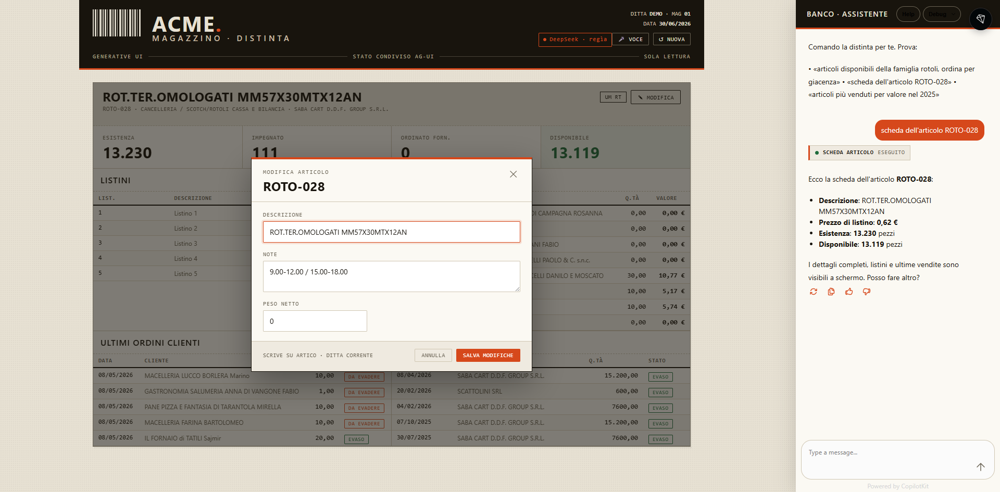 | **CRUD**: modale di modifica (descrizione/note/peso) — scrittura deterministica, non passa dall'LLM |
| 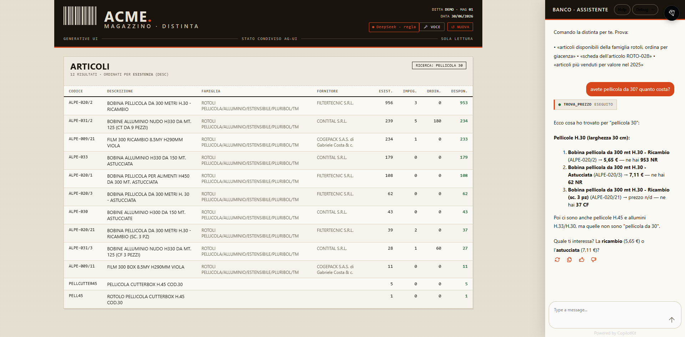 | «avete pellicola da 30? quanto costa?» → prezzo e giacenza riferiti a voce (caso banco) |

### 2 · Vendite (l'LLM sceglie il grafico)
| Schermata | Cosa mostra |
|---|---|
| 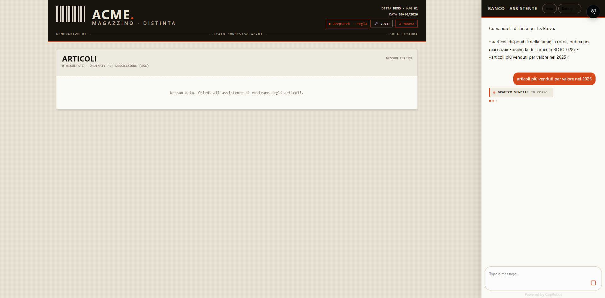 | «articoli più venduti per valore nel 2025» → barre (classifica) |
| 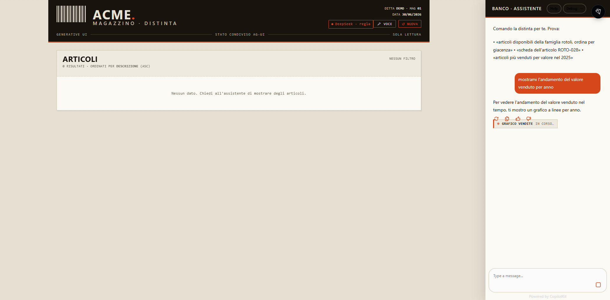 | «andamento del valore venduto per anno» → linea (tempo) |
| 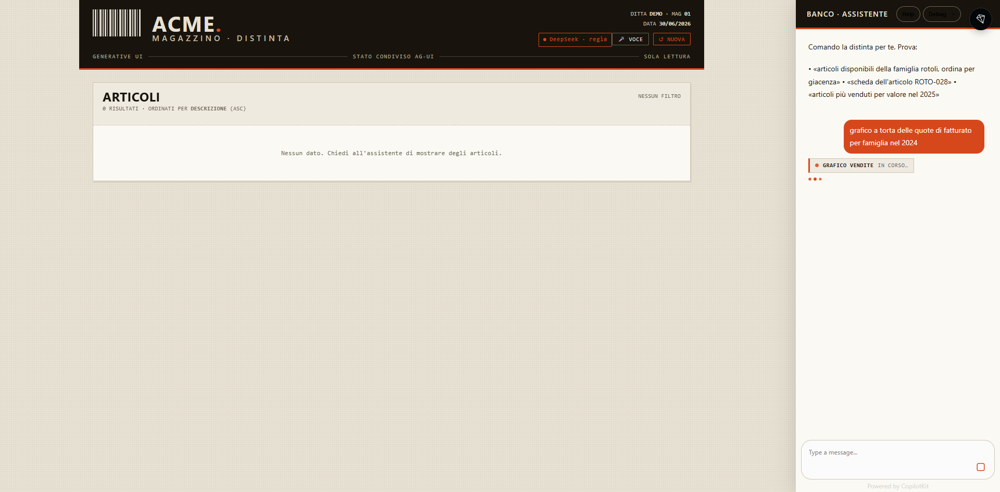 | «quote di fatturato per famiglia» → torta (composizione, top 7 + Altri) |

### 3 · Clienti
| Schermata | Cosa mostra |
|---|---|
| 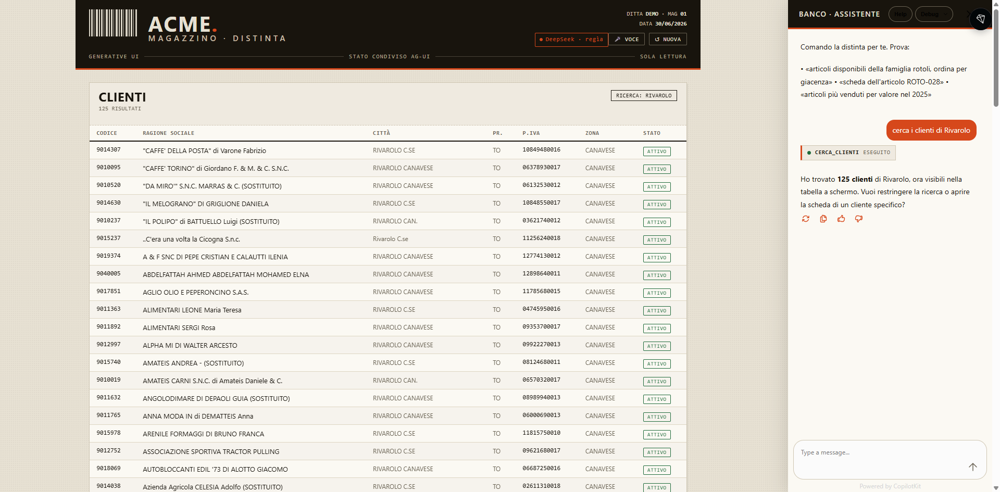 | «cerca i clienti di Rivarolo» → elenco clienti (righe cliccabili) |
| 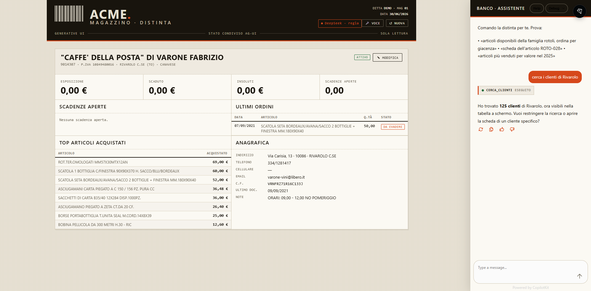 | **Click su una riga** → scheda cliente (apertura senza LLM): esposizione, **scaduto**, scadenze aperte, ordini, top articoli, anagrafica |
| 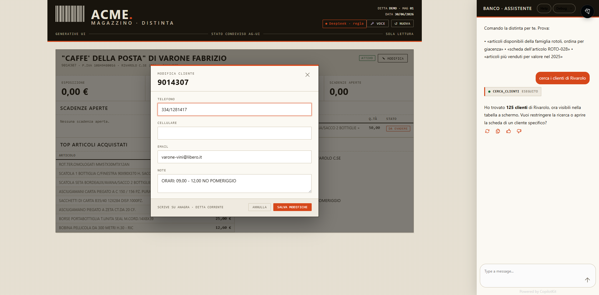 | **CRUD cliente**: modale contatti (telefono/cellulare/email/note) |

## Messaggi chiave per la presentazione

1. **Constrained UI** — l'LLM non disegna nulla: sceglie *quale* componente e *con quali dati*. Niente allucinazioni sui numeri.
2. **Privacy STRICT-selettiva** — dati personali (clienti, scadenze, importi) **solo a schermo**, mai all'LLM. Prodotti (prezzo/giacenza) verbalizzabili.
3. **Stato condiviso bidirezionale** — la chat pilota la UI *e* la UI (click su riga) aggiorna lo stato senza coinvolgere l'LLM.
4. **Scritture controllate** — CRUD deterministico con conferma, fuori dal percorso LLM.
5. **Su ERP legacy** (NTS Business), multitenant via `CODDITT`, costo LLM irrisorio, swappabile a modello locale per GDPR-puro.
